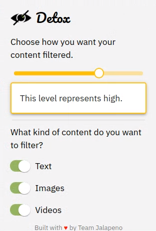
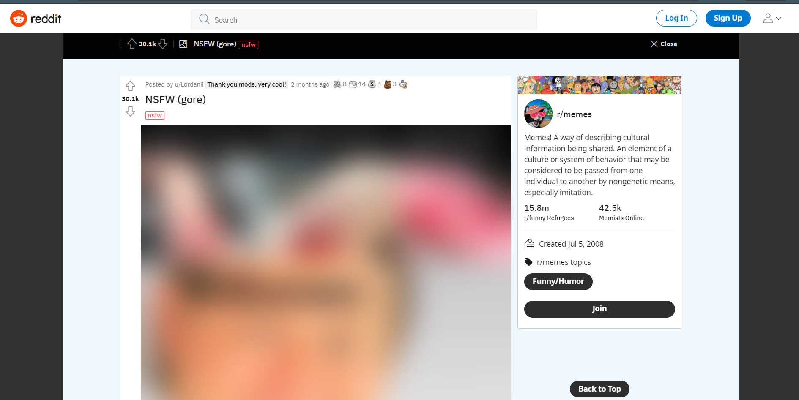

<!-- PROJECT LOGO -->
<p align="center">
  <a href="/">
    
  </a>

  <h3 align="center">detox-chrome-extension</h3>

  <p align="center">
    Keep your browsing free from sensitive content.
    <br />
    <a href="/"><strong>Explore the docs »</strong></a>
    <br />
    <br />
    <a href="/">View Demo</a>
    ·
    <a href="https://github.com/Team-WhiteHatSr/detox-chrome-extension/issues">Report Bug</a>
    ·
    <a href="https://github.com/Team-WhiteHatSr/detox-chrome-extension/issues">Request Feature</a>
  </p>
</p>


<!-- TABLE OF CONTENTS -->
## Table of Contents

* [About the Project](#about-the-project)
  * [Built With](#built-with)
* [Getting Started](#getting-started)
  * [Prerequisites](#prerequisites)
  * [Installation](#installation)
* [Usage](#usage)
* [Roadmap](#roadmap)
* [Contributing](#contributing)
* [License](#license)
* [Contributors](#contributors-)


<!-- ABOUT THE PROJECT -->
## About The Project

`Detox` is an AI-powered chrome-extension that lets you control what you see when you are browsing the web. With the help of `Detox`, you can choose to blur out obscene images, videos, and text, and concentrate on your work/scroll through social media peacefully.

<p align="center">
    
</p>

On the chrome-extension popup, you can choose the strictness with which you want `Detox` to filter text and media on the webpage. You can also choose the type of content you want to filter by enabling/disabling switches on the extension. By default, text, images, and videos will be enabled.

> `Detox` only uses Open-Source APIs and libraries. Image content detection is performed on the client-side. Text is sent to the server (the [source code](https://github.com/Team-WhiteHatSr/detox-backend) for which is also Open Source). However, the text sent to our servers is not stored and not linked to a user in any way.

### Built With

* [Typescript](https://www.typescriptlang.org/)
* [React](https://reactjs.org/)
* [nsfwjs](https://github.com/infinitered/nsfwjs)


<!-- GETTING STARTED -->
## Getting Started

To get a local copy up and running follow these simple steps.

### Prerequisites

* npm
* Google Chrome

### Installation
 
1. Clone the repo.
```sh
git clone https://github.com/Team-WhiteHatSr/detox-chrome-extension.git
cd detox-chrome-extension
```
2. Install NPM packages.
```sh
npm install
```
3. Build the extension. This will create a `dist` folder.
```sh
npm run build
```
4. Head to [chrome://extensions](chrome://extensions) and turn on `Developer mode` on the top right corner.
5. Click on `Load unpacked`, and select the `dist` folder that was created in the `build` step.
6. The extension should now be available on the extension bar on chrome.


<!-- USAGE EXAMPLES -->
## Usage

Once the extension is installed, you can visit any website and any "toxic" content on the webpage should be blurred out. You can choose to turn off the filtering by toggling the switches on the extension.

When filtering images, the extension will initially *blur out all images*, and then unblur them only if the algorithm decides that the content is SFW. We do this to decrease the chances of a user seeing a "toxic" or "NSFW" image, by blurring everything instantly, and unblurring them based on the results obtained with the ML model.

> The model used has an accuracy of ~90%.

The slider on the extension sets the strictness, i.e., the threshold value for the prediction. There are 4 levels on the slider.

* **off** - Media and text will not be filtered.
* **low** - Media and text will be filtered only if the content is extremely sensitive.
* **moderate** - Media and text will be filtered if the content is moderately sensitive.
* **high** - Media and text will be filtered even if the content is slightly sensitive.

To stop the extension, move the slider to the extreme left, or toggle all the switches to the "off" state.

<p align="center">
    
    <br />
    The screenshot above shows the extension in action.
</p>

<!-- ROADMAP -->
## Roadmap

See the [open issues](https://github.com/Team-WhiteHatSr/detox-chrome-extension/issues) for a list of proposed features (and known issues).


<!-- CONTRIBUTING -->
## Contributing

Contributions are what make the open source community such an amazing place to be learn, inspire, and create. Any contributions you make are **greatly appreciated**.

1. Fork the Project
2. Create your Feature Branch (`git checkout -b feature/AmazingFeature`)
3. Commit your Changes (`git commit -m 'feat: Add some AmazingFeature'`)
4. Push to the Branch (`git push -u origin feature/AmazingFeature`)
5. Open a Pull Request

You are requested to follow the contribution guidelines specified in [CONTRIBUTING.md](./CONTRIBUTING.md) while contributing to the project :smile:.

<!-- LICENSE -->
## License

Distributed under the MIT License. See [`LICENSE`](./LICENSE) for more information.


<!-- MARKDOWN LINKS & IMAGES -->
<!-- https://www.markdownguide.org/basic-syntax/#reference-style-links -->
